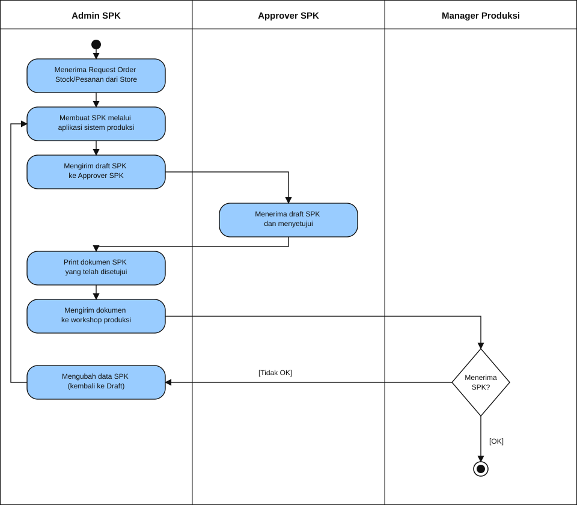

# Alur Pembuatan SPK

Dokumen ini menjelaskan alur bisnis pembuatan Surat Perintah Kerja (SPK) di sistem produksi Wanda House of Jewels.

## Pelaku

| Peran | Tanggung jawab |
| --- | --- |
| Store | Mengirim Request Order Stock/Pesanan ke Admin SPK |
| Admin SPK | Menerima Request Order, membuat draft, mengirim ke approver, mencetak, dan mengirim dokumen ke workshop |
| Approver SPK | Menerima draft dan menyetujui SPK |
| Manager Produksi | Menerima SPK di workshop, menyetujui atau menolak |

## Activity diagram (swimlane)

Tiga kolom vertikal adalah *partition* (swimlane) per aktor. Proses dimulai di lane Admin SPK setelah Request Order Stock/Pesanan diterima dari Store. Alur berjalan dari atas ke bawah dan pindah lane saat pekerjaan berpindah tangan.

| Notasi | Arti |
| --- | --- |
| Lingkaran hitam | *Initial node* — proses mulai |
| Kotak sudut membulat | *Action* |
| Belah ketupat | *Decision* |
| `[OK]` / `[Tidak OK]` | *Guard* pada *control flow* |
| Lingkaran ganda | *Final node* — proses selesai |

## Langkah proses

### 1. Admin SPK menerima Request Order dari Store

Admin SPK menerima Request Order **Stock** atau **Pesanan** dari Store. Ini menjadi dasar pembuatan SPK.

### 2. Admin SPK membuat SPK

Admin SPK membuat SPK baru melalui aplikasi sistem produksi, merujuk Request Order yang diterima. Dokumen tersimpan sebagai **draft**.

### 3. Admin SPK mengirim draft ke Approver SPK

Setelah data lengkap, Admin SPK mengirim draft SPK ke Approver SPK untuk ditinjau.

### 4. Approver SPK menerima dan menyetujui

Approver SPK menerima draft, meninjau isinya, lalu menyetujui SPK. Alur kembali ke lane Admin SPK.

### 5. Admin SPK mencetak dokumen

Admin SPK mencetak dokumen SPK yang sudah disetujui Approver SPK.

### 6. Admin SPK mengirim dokumen ke workshop

Dokumen cetak dikirim ke workshop produksi. Alur pindah ke lane Manager Produksi.

### 7. Manager Produksi menerima SPK

*Decision node.* Manager Produksi meninjau SPK di workshop:

- **[OK]** — menuju *final node*; SPK disetujui dan masuk proses produksi.
- **[Tidak OK]** — *control flow* kembali ke lane Admin SPK.

### 8. Reject: kembali ke draft

Status kembali menjadi **draft**. Admin SPK mengubah data SPK, lalu mengulang dari *action* langkah 2 (membuat/memperbarui SPK). Request Order dari Store tidak perlu diterima ulang.
